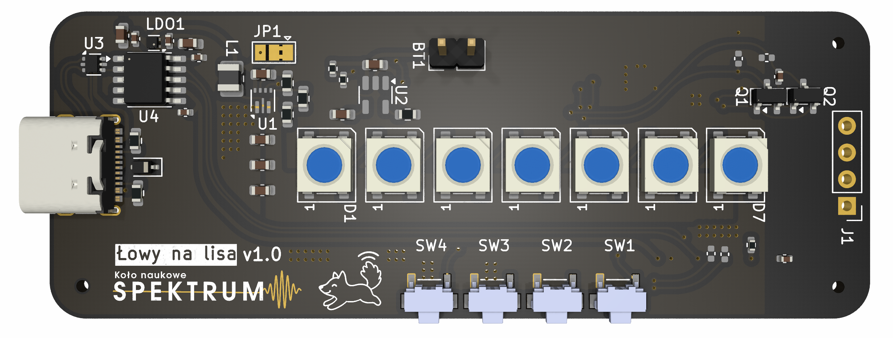
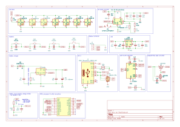
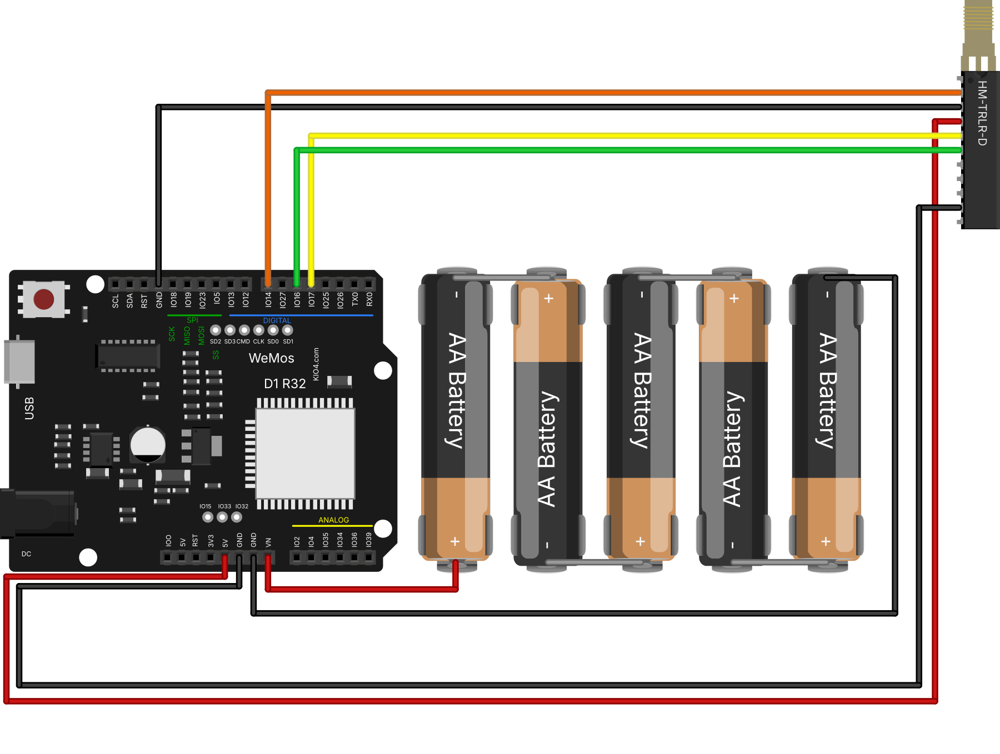
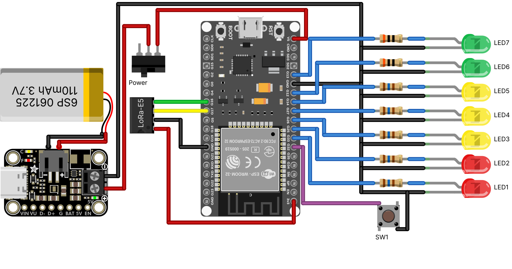

# Łowy na Lisa

Gra terenowa dla dzieci oparta na LoRa - polega na znalezieniu ukrytych nadajnikiów ("lisów") wykorzystując siłę sygnału radiowego

## O projekcie

"Łowy na Lisa" to otwarty projekt hardware'owy tworzący ręczne urządzenia do polowania na nadajniki LoRa. Każdy uczestnik otrzymuje kompaktowe urządzenie wyposażone w:

- Wyświetlacz OLED z animowaną mascotką lisa (szczęśliwy smutny w zależności od siły sygnału)
- Pasek 7 diod WS2812B pokazujących kierunek i siłę sygnału
- 4 przyciski do obsługi menu
- Obsługę baterii LiPo z ładowaniem przez USB-C
- Tryb głębokiego snu dla długiej pracy na baterii

### Hardware
- **MCU:** CubeCell HTCC-AM01
- **LEDy:** 7x WS2812B NeoPixel (adresowalne)
- **Wyświetlacz:** 0.96" OLED I2C
- **Przyciski:** 4x na boku
- **Zasilanie:** Bateria LiPo ~500mAh + ładowarka TP4054
- **USB:** USB-C z konwerterem CH340K (programowanie)
- **Antena:** 868MHz, Własnoręcznie stworzona przez nas antena yagi (wczesniej zewnętrzna antena yagi telewizyjna) 
- **Wymiary:** Podłużna obudowa przyjazna dla dzieci

## Wersje

- [Odbiornik na PCB (CubeCell)](#pcb) - docelowa wersja na własnej płytce
- [Nadajnik ESP32](software/fox-transmitter/README.md) - "lis": WeMos D1 R32 + HM-TRLR-D-TTL-868, zasilanie 5x AA
- [Odbiornik ESP32](software/led-receiver/README.md) - ESP32 + Seeed LoRa-E5 + 7 diod, zasilanie LiPo
- [Flota i aktualizacje](software/ota/README.md) - strona w Chrome: które urządzenia ESP32 są włączone, na jakim kanale i programie; podpisane aktualizacje przez Bluetooth

<b>Odbiornik na PCB (CubeCell)</b> - schemat i plot

Plot  |  Schemat
:-------------------------:|:-------------------------:
  |  

Program: [software/receiver](software/receiver/receiver.ino)

<b>Nadajnik ESP32</b> - schemat połączeń i kanały

D1 R32  |  HM-TRLR-D / baterie  |  Opis
:-------------------------:|:-------------------------:|:-------------------------
IO17 (TX)  |  RXD  |  komendy AT i dane do modułu
IO16 (RX)  |  TXD  |  odpowiedzi modułu
IO14  |  CONFIG  |  LOW = konfiguracja (AT), HIGH = nadawanie
5V  |  5V  |  zasilanie modułu
GND (górny, obok IO18)  |  GND (górny)  |
GND (dolny)  |  SLEEP  |  SLEEP na GND = moduł nie zasypia
VIN  |  + baterii 5x AA  |  ok. 7.5 V
GND (obok VIN)  |  - baterii  |

Id  |  Częstotliwość  |  Zworki CH_1-CH_4 (od góry)
:-------------------------:|:-------------------------:|:-------------------------:
1  |  863.0 MHz  |  ○ ○ ○ ○
2  |  863.5 MHz  |  ● ○ ○ ○
3  |  864.0 MHz  |  ○ ● ○ ○
4  |  864.5 MHz  |  ● ● ○ ○
5  |  865.0 MHz  |  ○ ○ ● ○
6  |  865.5 MHz  |  ● ○ ● ○
7  |  866.0 MHz  |  ○ ● ● ○
8  |  866.5 MHz  |  ● ● ● ○

Programowanie i szczegóły: [software/fox-transmitter](software/fox-transmitter/README.md)

<b>Odbiornik ESP32</b> - schemat połączeń

ESP32  |  Element  |  Opis
:-------------------------:|:-------------------------:|:-------------------------
G33, G25  |  LED1, LED2 (czerwone)  |  rezystor 160 Ω
G26, G27, G14  |  LED3-LED5 (żółte)  |  rezystor 160 Ω
G12, G13  |  LED6, LED7 (zielone)  |  rezystor 30 Ω
G32  |  przycisk  |  drugi pin do GND
G17 (TX2)  |  LoRa-E5 RX (pad 9)  |  komendy AT
G16 (RX2)  |  LoRa-E5 TX (pad 10)  |  odpowiedzi i pakiety
3V3, GND  |  LoRa-E5 VCC (pad 1), GND (pad 2)  |
V5  |  wyłącznik → przetwornica 5 V → LiPo  |

Obsługa i programowanie: [software/led-receiver](software/led-receiver/README.md)

## PCB

Projekt PCB znajduje się w katalogu `pcb/` i jest przygotowany pod produkcję w JLCPCB (z PCBA assembly).

[Model 3D](pcb/lowy-na-lisa.stl)

Plot  |  Schemat
:-------------------------:|:-------------------------:
  |  

## Historia projektu

### Faza 1: Eksperymenty
- Testy modułów nRF905 - działają ale brak RSSI
- Przejście na moduły HM-TRLR-D-TTL-868 (LoRa/FSK/GFSK + RSSI)
- Brute-forceowanie komend AT modemu LoRa

### Faza 2: Targi Hobby
- Pierwsza działająca wersja
- Testy z dziećmi - obudowa sprawdza się, anteny za duże
- Problem: nadajniki się zakłócały (rozwiązane: różne kanały)
- Pozytywne wrażenia: światełka wzbudzają zainteresowanie

### Faza 3: PCB
- Projekt PCB zintegrowanego z modułem CubeCell
- Optymalizacja pod baterię (deep sleep, odcięcie LEDów)
- Przygotowanie pod produkcję SMT w JLCPCB

## Pomysły/Plany na rozwój

- **Tryby gry:**
  - Zdobywanie nadajników (zbliżenie się + potwierdzenie przyciskiem)
  - Rywalizacja (broadcast pozycji na innym kanale)
  - Tryb fabularny z questami

- **Animacje:**
  - Lis wyskakujący z krzaka przy zbliżeniu do nadajnika
  - Wizualizacja siły sygnału na ekranie i LEDach
  - Różne stany emocjonalne mascotki

- **Hardware:**
  - Własnoręcznie robione anteny DIY
  - Ulepszona obudowa z integracją PCB
  - Druk 3D

## Autorzy

- Hubert Mucha - Antena
- Antoni Sacewicz - Antena
- Judyta Ferenc - Antena
- Antoni Antosik - obudowa 3D
- Adrian Bruch - Animacje i interfejs ekranu
- Katarzyna Rybarkiewicz - Lider, Projekt PCB
- Maximilian Gaedig - Aktualny Lider, Projekt PCB, Software
# na rekrutacji

wiktor kandulski, discord: kandul - marketing, kolaboracja z harcerstwem
tymoteusz majorek, discord: tymoteuszu - materiały marketingowe/instrukcje - pisanie zaawansowane (pisał kśiążki), 3D
beata waligórska, discord: slaani. - animacje

## Licencja

GPLv3
