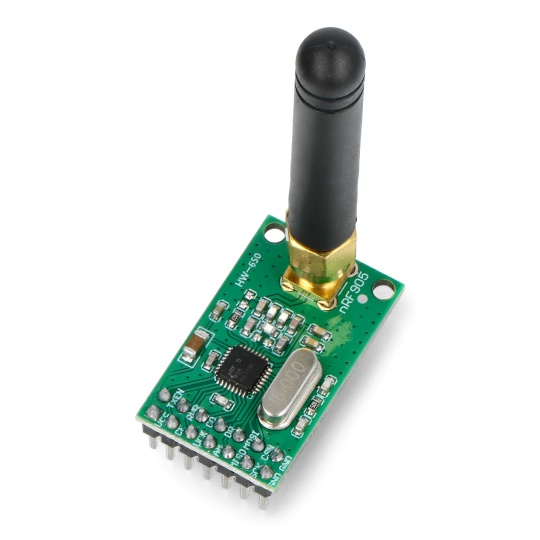
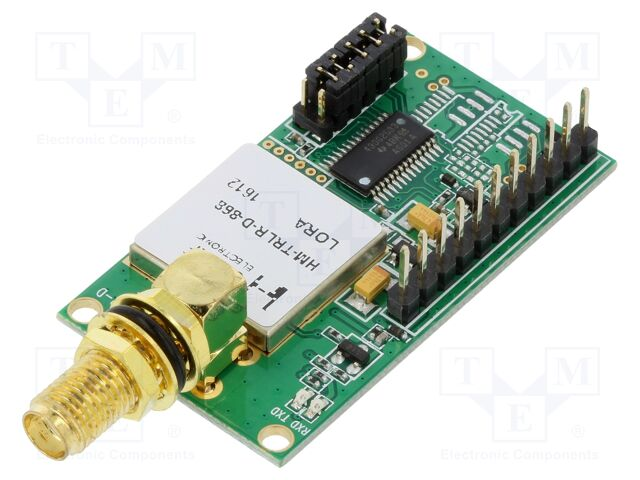

---
theme:
  override:
    code:
      alignment: left
      background: false
---

Coś działa
===

Moduły nrf905 działały odrazu po skonfigurowaniu przykładu z libki nrf905 na arduino, ale jeden kabel był podłączony w złym miejscu więc aż to działało mineły 2 dni.

Możemy spingować moduły, ale zawsze nam pokazują ten sam RTT bo różnica czasowa jest za mała by ją zarejestrować.

Niestety te moduły nie nadają się do naszych łowów...

<!-- end_slide -->

Nowe moduły!
===

<!-- column_layout: [1, 1] -->

<!-- column: 0 -->

# Doszły nam wczesniej

## nrf905

- działają, pingują się
- nie podają nam RSSI
- tylko działają na LoRa

<!-- column: 1 -->

# Doszły nam pózniej

## HM-TRLR-D-TTL-868

- nie mamy jescze kodu dla nich
- mają różne modulacje - FSK, GFSK, LoRa
- powinny nam podawać moc odebranego sygnału
- miały przyjść wczesniej...

<!-- end_slide -->

Co teraz?
===

Zajmujemy się modułami HM-TRLR-D-TTL-868 i przepisujemy kod na te moduły.

Raczej powinniśmy się jescze zmieścic w terminie wczesniej założonym, skończyć pierwszą wersje przed końcem tego miesiąca.
