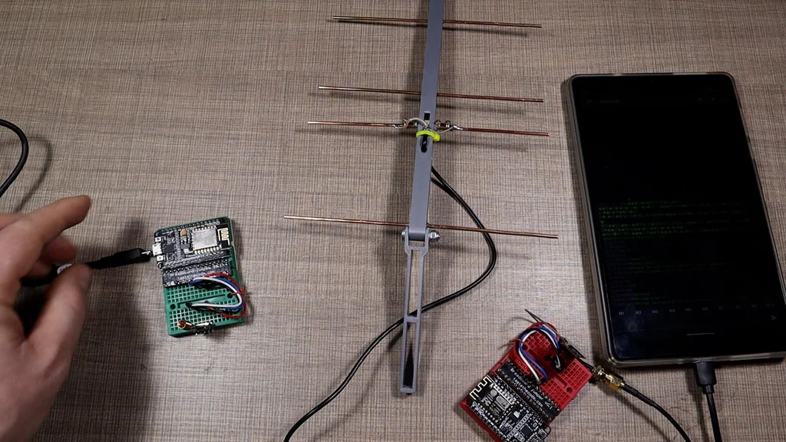

# Łowy na Lisa - Update 15.01.26

## targi hobby
- pierwsza działająca wersja/prezentacja dla dzieci
- zauważenie że antena za duża dla dzieci
- dobre wrażenie - obudowa poręczna
- dobra dekoracja
- swiatełka wzbudzały zainteresowanie

## nadajniki się zakłucały
- było tylko odróżnianie po id wysyłanym w pakiecie lora
- nadawały były na tym samym kanale
- prosty fix: różne kanały

## plany na przyszłość 

### ekran
- maskotka lisek
- wizualizacja sygnału (lisek smutny/sczęsliwy)
- zmiana kalibracji
- ekran z deltalami: snr/rssi / detale na main screen
- stan baterii
- hint obsługi

#### animacje
- animacja jak sie dojdzie do nadajnika będzie karton, karton się otworzy i lis wyskoczy

### własnoręcznie robione anteny DIY
- druty
- kable
- druk 3d :)

### kalibracja
- przy resetcie?

#### pomysły na zabawe
- zdobywanie nadajników (nadajnik blisko + potwierdzenie guzikiem) (przeskoczenie na następny kanał?)
- rywalizacja (broadcast aktualnego poziomu/nadajnika na innym kanale)
- story wymysleć

### polepszenie obudowy
- integracja pcb

### pcb
- stan baterii (voltage divider)
- ładowanie (moduł tpXXXX) + usb c
- Regulator LDO bateria -> 3.3v
- integracja z modułami CubeCell AM01
- podłączenie do anteny U.FL Receptacle jest już integrowane w CubeCell
- ledy + rezystory
- złącze na ekran
- złącza na guziki (reset + menu1 + menu2)

## dalszy plan
- 25.02.26 środa spotkanko 17:00 - pcb v1 i test antena
- 05.03.26 pcb final - zamówienie
- 25.03.26 spotkanko, zkładanie, lutowanie

## pytania?

## rozłożenie zadań
- animacje/pixelizacja liska - Adrian - do 15.03.26
- pcb - v1 Kasia - do 25.02.26 - muszę podać plan pinów 
- antena - Hubert + Antek - do 25.02.26 (blocked by order + druk (Max))
- programowanko - Adrian i Max - bez stanu bateri do 15.03.26 - dodanie stanu bateri do 30.03.26
- story - Antek
- obudowa - Antek3D (blocked by pcb (Kasia))
### cel - noc naukowców - wrzesień

## plan prezentacji
- Hubert - targi hobby
- Max - zakułucanie się nadajników
- Adrian - animacje/interfejs ekranu

